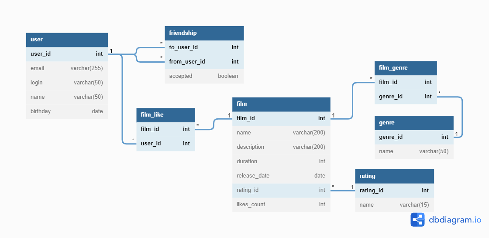

# Filmorate
Backend на java для сервиса по работе с фильмами и оценками пользователей, возможностью получения списка фильмов с наивысшим рейтингом, рекомендованных к просмотру комьюнити.

## Описание
Бэкэнд (rest api) соцсети, в котором пользователи могут:
- оценивать фильмы для составления рейтинга;
- писать отзывы фильмам;
- оценивать отзывы;
- получать рейтинг популярных фильмов;
- получать фильмы по режиссерам;
- искать фильмы;
- получать общие фильмы друзей;
- добавлять пользователей в друзья;
- получать рекомендованные пользователю фильмы по оценкам;
- просматривать ленту событий пользователя.

## Технологии
- Java 11, Lombok;
- Spring Boot;
- JDBC, SQL, H2;
- Maven, Swagger, Junit;
- Postman.

### Entity-relationship diagram ###

Выше представлена ER-диаграмма с указанием первичных ключей и видов связи.
Для хранения нескольких жанров фильма, а также для обеспечения уникальности лайков (1 user = 1 like) была организована связь многие-ко-многим с помощью соединительных таблиц.

Поскольку (в связи со спецификой приложения) планируется частое обращение к количеству лайков для каждого фильма и сортировки общего списка (составление рейтинга), то с целью увеличения производительности в таблицу film был также добавлен film_count, значение которого будет увеличиваться на единицу при каждом добавлении лайка фильму.

Примеры запросов для основных операций при работе с приложением: 
- получение топ N наиболее популярных фильмов (сортировка по рейтингу) с дополнительной информацией по каждому из них,
- изменение рейтинга фильма (добавление и удаление лайка), 
- отправка запроса на добавление в друзья (возможность отправлять и принимать предложения о дружбе), 
- получение списка общих друзей с другим пользователем.
